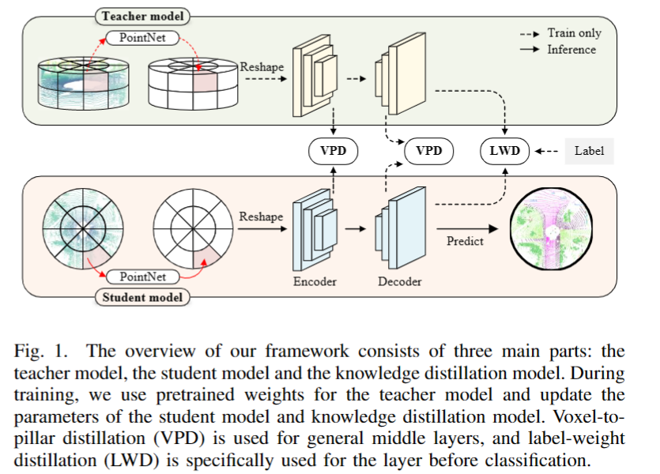
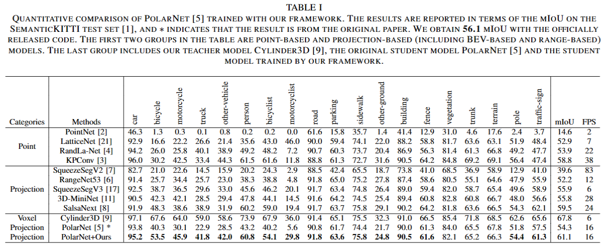
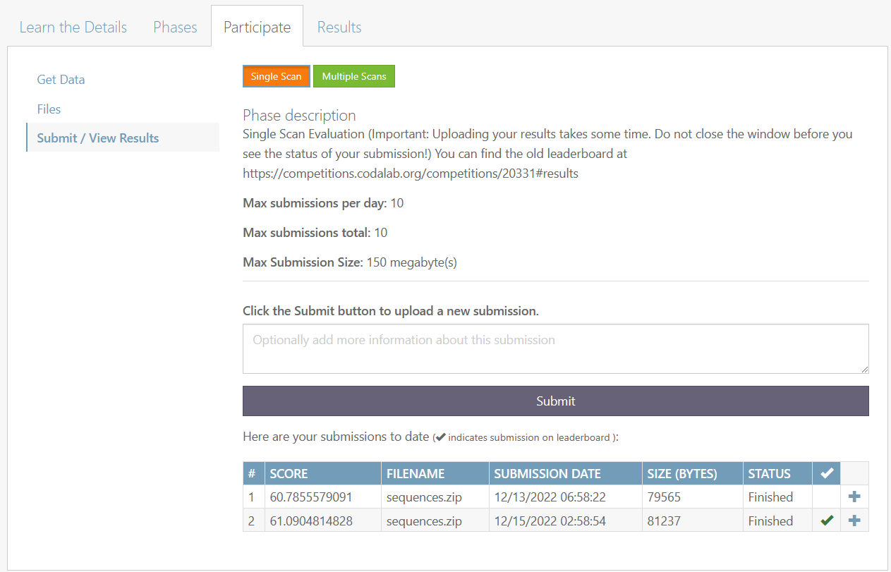
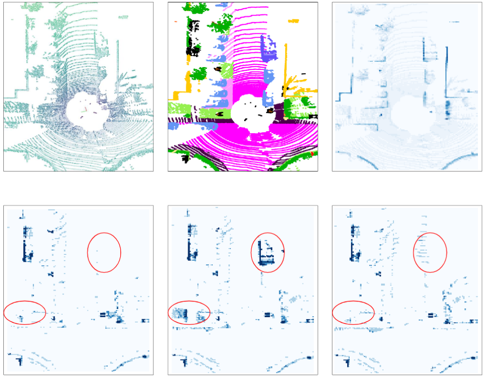

# Knowledge Distillation from 3D to Bird's-Eye-View for LiDAR Semantic Segmentation

- **2023-03** We release our main code for valid our model.
- **2023-03** Our [paper](https://arxiv.org/abs/2304.11393) is accepted by ICME 2023.

## Model
The architecture of our framework. Our framework has three main parts, similar to other knowledge distillation methods. The first is the teacher model, and here, we choose voxel-based methods as our teacher model, which have high accuracy but suffer from a computational burden. Voxel-based methods usually encode each voxel and have more geometric and structural features. We choose BEV-based methods as the student model because they are usually efficient for practical application. The last part is the knowledge distillation model, which is the main part of our framework. Benefiting from our well-designed voxel-to-pillar distillation module and label-weight distillation module, the student model can learn more valuable information during training and improve the inference performance without extra computation. In addition, we also used logit distillation.


## Results


Above is the result in our paper. This is the results of SemanticKITTI dataset.
We can see that our distillation can really work between Cylinder3D and PolarNet.The results on SemanticKITTI show more than 5\% improvement on the test set, especially for classes such as motorcycle and person, with more than 15\% improvement.

Here is the screen shot of our results on official [competition webset](https://codalab.lisn.upsaclay.fr/competitions/6280#results).



## Visulation



You can see that our model can well work at the regions with more height information. For more explanation, you can see from our paper Section Ⅳ.E.
## Install

You can simply follow Cylinder3D's [description](https://github.com/xinge008/Cylinder3D#installation).

## Data Preparation
You can download the dataset from [here](http://www.semantic-kitti.org/dataset.html#download).

We follow offical split of train and test set.   
### SemanticKITTI
```
./
├── 
├── ...
└── dataset/
    ├──sequences
        ├── 00/           
        │   ├── velodyne/	
        |   |	├── 000000.bin
        |   |	├── 000001.bin
        |   |	└── ...
        │   └── labels/ 
        |       ├── 000000.label
        |       ├── 000001.label
        |       └── ...
        ├── ...
        ├── 10/
        │   ├── velodyne/	
        |   |	├── 000000.bin
        |   |	├── 000001.bin
        |   |	└── ...
        │   └── labels/ 
        |       ├── 000000.label
        |       ├── 000001.label
        |       └── ...        
        ├── 08/ # for validation
        ├── 11/ # 11-21 for testing
        ├── ...
        └── 21/
```

## Pretrain Model
You can get our model from [here](https://drive.google.com/file/d/1Cux6yVjnet6ZnaSmAdJKE_IzkBuf91u_/view?usp=sharing). This is trained by our framework. And you can directly run `test_pretrain_SemanticKITTI_tta.py` after download `ours_test_61.1.pt` and put it in `pretrained/`.

Of course, you can also train from begining, but it is slow (about a week with single V100 GPU). So, we recommand that you can load pretrained teacher mdoel, Cylinder3D, from [cylinder3d_val_65.4.pt](https://drive.google.com/file/d/1G-zwBLYfpoi3uyLfsnQVOM4qraq73oG6/view?usp=sharing), by the way, you can also use pretrained model from [here](https://github.com/cardwing/Codes-for-PVKD#performance). Anyway, if you use pretrained model, you should put it it `pretrained/`.

## Train

We recommand you load pretrain model of Cylinder3D and **DO NOT UPDATE PARAMETERS**.
Remember to modify the pretrained path if you save them in other path or you have better checkpoints.
```
CUDA_VISIBLE_DEVICES=0 python train_SemanticKITTI.py --data_dir your_data_dir --model_save_path path_to_save_model --model_load_path pretrain_model
```
## Test

We test our model follow [PVKD](https://github.com/cardwing/Codes-for-PVKD)'s setting.

You can run by
```
CUDA_VISIBLE_DEVICES=0 python test_pretrain_SemanticKITTI_tta.py --data_dir your_data_path --model_save_path path_of_model --test_output_path path_to_save_results --test_batch_size=1
```
We only support `batch=1` when use **TTA** for better results on test set.

Then, you can follow [here](https://github.com/PRBonn/semantic-kitti-api) to valid format of your result.

## TODO LIST

- [ ] support more dataset
- [ ] support more tasks, such as Panoptic Segmentation
- [ ] support more pair of models

## Acknowledgment

Our code is mainly based on [Cylindr3D](https://github.com/xinge008/Cylinder3D), [PolarNet](https://github.com/edwardzhou130/PolarSeg) and TTA from [PVKD](https://github.com/cardwing/Codes-for-PVKD).

**Thanks for their excellent works!**

## Reference
If you find our paper or out code is useful, please cite us our paper
```
@inproceedings{knowledge3dtobev,
  title={Knowledge Distillation from 3D to Bird's-Eye-View for LiDAR Semantic Segmentation},
  author={Jiang, Feng and Gao, Heng and Qiu, Shoumeng and Zhang, Haiqiang and Wan, Ru and Pu, Jian},
  booktitle={2023 IEEE International Conference on Multimedia and Expo (ICME)},
  year={2023},
  organization={IEEE}
}
``` 